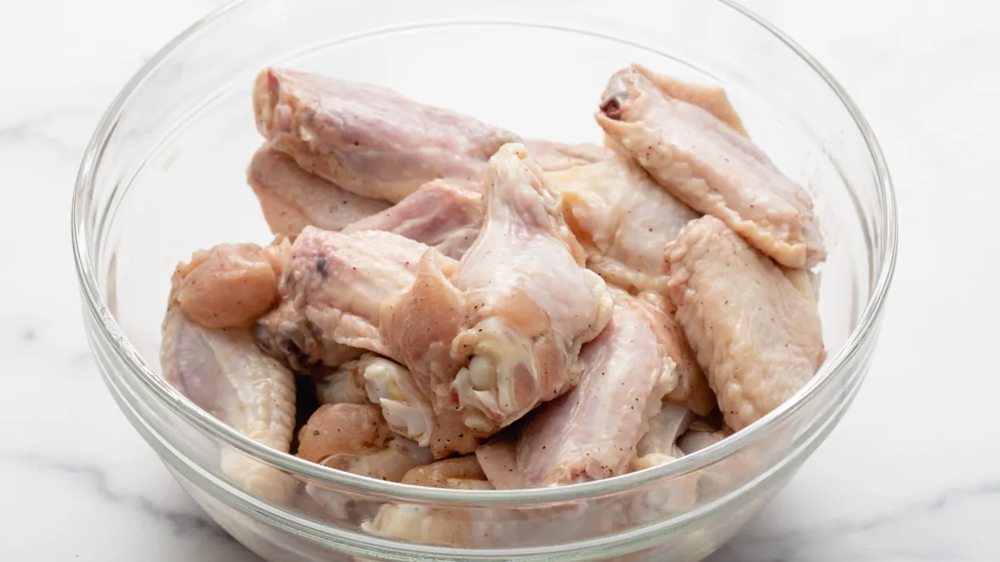
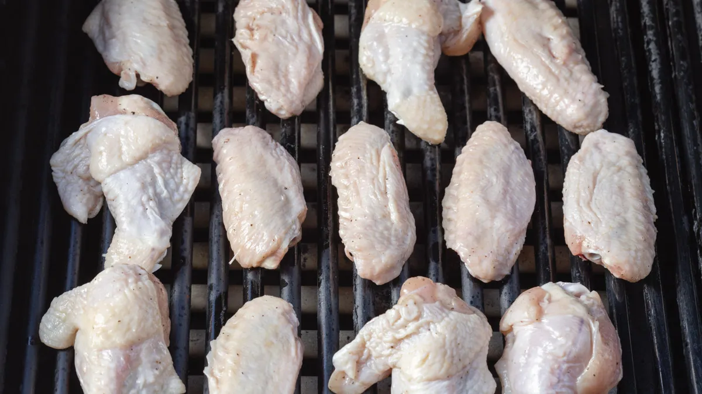
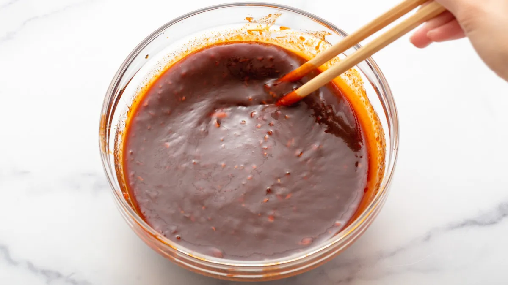
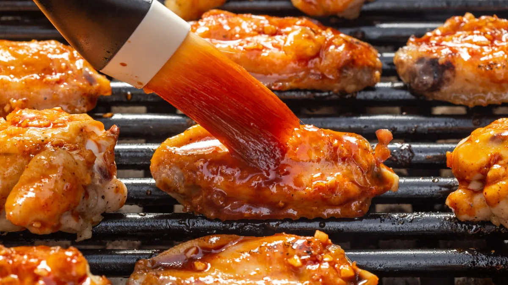
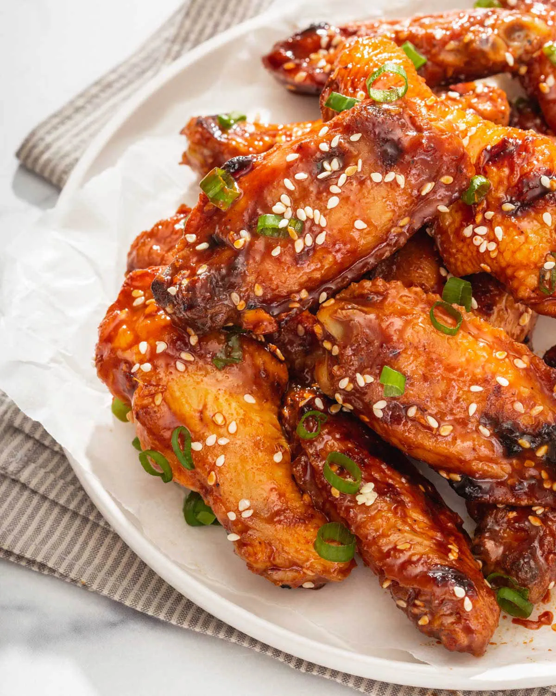

* `3 lbs` chicken winggs
* `2 tablespoon` vegetable oil
* `1/2 cup` Gochujang paste
* `1/2 cup` brown suger, packed
* `1 tablespoon` toasted sesame oil
* `2 tablespoon` rice vinegar
* `1/3 cup + 1 tablespoon` soy sauce
* `2 tablespoon` honey
* `1 tablespoon` minced garlic
* `1 1/2 tablespoon` minced fresh ginger
* Pinch of Kosher salt
* Pinch of ground pepper
* Sesame seeds and scallions for garnish

---

> # OPTION 1 ON THE GRILL
>
> **Grease and salt and pepper the chicken.** Toss the chicken wings in vegetable oil to prevent them from sticking. Then season salt and pepper.
>
> 

---

> **Grill the chicken on low heat.** Heat a charcoal or gas grill to low heat and lightly spray the grill with vegetable oil. Place the wings on the grill. Cover the grill and cook for 20-25 minutes or until most of the fat has rendered and the wings are cooked through.
>
> 

---

> **Mix the gochujang marinade.** While the wings are cooking, in a large mixing bowl, mix the gochujang, brown sugar, toasted sesame oil, rice vinegar, soy sauce, honey, minced garlic, and ginger together.
>
> 

---

> **Flip and baste.** After 20 minutes, flip the wings and baste the marinade onto the wings. Cover and cook for 10 minutes. Then, flip the chicken and marinate on the other side and continue cooking for another 10 minutes or until done.
>
> 

---

> **Coat with remaining sauce and serve.** Once cooked, toss the wings with the remaining sauce and serve hot.
>
> 

---

> # OPTION 2 IN THE OVEN
>
> **Prepare the oven.** Preheat the oven to 350°F and place the rack at the top of the oven. Line two baking sheets with foil and coat with nonstick cooking spray.

---

> **Grease and salt and pepper the chicken.** In a large bowl, toss the chicken wings with vegetable oil and season with salt and pepper.

---

> **Bake the chicken.** Place the wings, skin side up on the sheets, and roast them for 20-25 minutes until the top is golden brown.

---

> **Mix the gochujang marinade.** While the wings are cooking, in a large mixing bowl, mix the gochujang, brown sugar, toasted sesame oil, rice vinegar, soy sauce, honey, minced garlic, and ginger together.

---

> **Flip and baste.** Flip the chicken wings with the glaze with the fish sauce glaze and bake for another 10-15 minutes until browned. Flip the chicken, baste the other side and bake for another 5-10 minutes or until cooked.

---

> **Coat with remaining sauce and serve.** Once cooked, toss the wings with the remaining sauce and serve hot.

> # NOTES
>
> - **Use a food processor for the garlic and ginger.** Using a food processor grind the garlic and ginger so quickly and minces it to the finest texture you want for these wings.
> - **To prevent sticking, spray the grill with vegetable oil.** This prevents the skin of the chicken from sticking to the grill.
> - **Cook the wings low and slow.** This guarantees a juicy cooked wing that you can control how quickly it cooks.
> - **Keep one burner off in case some wings are cooked quicker.** Move the wings that are cooked quicker over the cooler burner to prevent them from burning.
> - **Storage Instructions:** You can store these Korean Gochujang chicken wings in an airtight container in the refrigerator for up to 5 days.